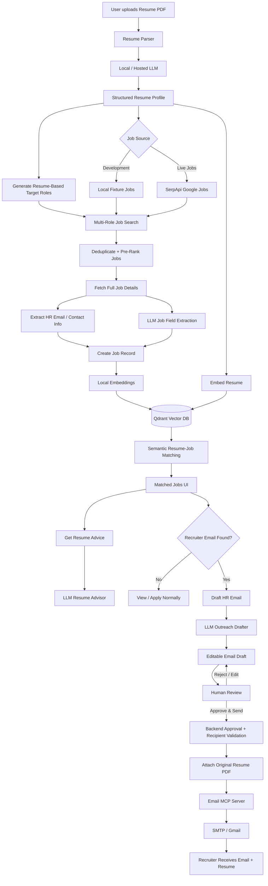

# Resume AI Agent

An AI-powered job discovery, resume matching, career-advice, and recruiter-outreach system.

This branch extends the original job matcher into a complete human-in-the-loop workflow:

- discover jobs from Google Jobs through SerpApi
- run fully offline with local fixture jobs during development
- parse a user's resume with a local or hosted LLM
- generate resume-driven multi-role job searches
- deduplicate and pre-rank job results
- extract structured job information
- embed jobs and resumes for semantic matching with Qdrant
- identify recruiter/HR contact information present in job descriptions
- draft personalized application emails from the user's resume
- require explicit human approval before sending
- send the approved email with the resume PDF through an Email MCP server

The project is designed to run without paid LLM APIs by using **LM Studio + sentence-transformers + Qdrant locally**.

---

## Workflow



---

## Core Features

### 1. Resume Parsing

The uploaded PDF resume is parsed into a structured candidate profile containing information such as:

- name and email
- summary
- technical skills
- tools and technologies
- education
- certifications
- projects
- experience
- seniority
- target roles

The parsed profile is reused for job discovery, semantic matching, resume advice, and recruiter outreach.

### 2. Resume-Driven Multi-Role Job Search

Instead of searching only one manually entered keyword, the system can derive up to several target roles from the parsed resume.

Example:

```text
AI Engineer
Machine Learning Engineer
LLM Engineer
```

The system searches those roles, combines the results, removes duplicates, pre-ranks them, and then continues with the normal extraction and embedding pipeline.

Endpoint:

```text
POST /api/v1/scrape/resume/stream
```

### 3. Google Jobs Through SerpApi

For live job discovery, the project uses the SerpApi Google Jobs API.

Supported search options include:

- keywords
- location
- country
- language
- radius
- date posted
- job type
- work type
- pagination
- optional Google `uds` filtering

Pagination uses SerpApi's `next_page_token`.

Application links are taken from `apply_options` when available and fall back to the Google Jobs share URL.

### 4. Offline Fixture Mode

You do not need a SerpApi key while developing the AI workflow.

Set:

```dotenv
JOB_SOURCE=fixture
LOCAL_JOBS_FIXTURE=fixtures/jobs.json
```

The project then reads sample jobs from:

```text
backend/fixtures/jobs.json
```

This lets you test the complete pipeline without any live job API:

```text
Resume
 -> Resume parsing
 -> Multi-role search
 -> Job extraction
 -> Contact extraction
 -> Embeddings
 -> Qdrant matching
 -> Resume advice
 -> Email drafting
 -> Human approval
 -> Email MCP
```

### 5. Duplicate Detection and Pre-Ranking

When multiple searches return the same job, the system deduplicates results before expensive LLM and embedding calls.

Deduplication prioritizes:

1. SerpApi `job_id`
2. fallback fingerprint of title + company + location

A lightweight discovery score considers:

- role/title relevance
- description relevance
- recency

This reduces unnecessary:

- LLM extraction calls
- embedding requests
- duplicate Qdrant records
- duplicate job cards

### 6. Semantic Resume-Job Matching

Job descriptions and the user's structured resume profile are embedded and stored/searched through Qdrant.

The default local embedding configuration uses:

```text
sentence-transformers/all-MiniLM-L6-v2
```

The system then retrieves the most semantically relevant jobs for the user.

### 7. AI Resume Advice

For any matched job, the user can request job-specific resume improvement advice.

The advisor compares:

- resume summary
- skills
- tools
- experience
- projects
- education
- certifications

against the selected job and returns targeted suggestions without inventing candidate experience.

### 8. Recruiter Contact Detection

The system scans the real job source text for contact information.

Supported contact extraction currently includes:

- email addresses
- phone numbers

Email detection is deterministic. The LLM is not allowed to invent recruiter or HR addresses.

If multiple email addresses are found, recruiter-oriented addresses containing terms such as `recruit`, `talent`, `hiring`, `career`, `jobs`, `hr`, or `people` are preferred.

### 9. Personalized Recruiter Email Drafting

When a job contains an email address, the UI displays:

```text
Draft HR Email
```

The email draft uses:

- selected job
- company
- job description
- required skills
- responsibilities
- candidate resume
- candidate experience
- candidate projects
- candidate skills

The drafter is explicitly instructed not to fabricate qualifications, referrals, recruiter names, skills, or experience.

### 10. Human-in-the-Loop Approval

Email sending is intentionally separated from email drafting.

Draft endpoint:

```text
POST /api/v1/outreach/draft
```

Send endpoint:

```text
POST /api/v1/outreach/send
```

The send endpoint requires:

```text
approved=true
```

Before sending, the backend also verifies that the selected recipient was actually extracted from that specific job posting.

The user can review and edit:

- recipient
- subject
- email body

before clicking:

```text
Approve & Send
```

### 11. Resume Attachment

The original uploaded PDF resume is attached to the approved email.

The application sends the resume to the Email MCP server as base64-encoded PDF bytes, so FastAPI and the MCP server do not need to share the same filesystem.

### 12. Email MCP Server

A standalone Email MCP service is included:

```text
email_mcp_server/
├── server.py
├── requirements.txt
├── .env.example
└── README.md
```

The MCP tool contract is:

```text
send_email(
    to_email,
    subject,
    body,
    pdf_base64,
    pdf_filename
)
```

The server validates the recipient and PDF attachment before sending through SMTP.

---

## Architecture

```text
                         ┌───────────────────────────┐
                         │       Next.js UI          │
                         └─────────────┬─────────────┘
                                       │ REST + SSE
                                       ▼
                         ┌───────────────────────────┐
                         │         FastAPI           │
                         │ JobMatcherOrchestrator    │
                         └─────────────┬─────────────┘
                                       │
            ┌──────────────────────────┼──────────────────────────┐
            │                          │                          │
            ▼                          ▼                          ▼
   ┌─────────────────┐       ┌──────────────────┐      ┌─────────────────┐
   │ Job Discovery   │       │ LLM Processing   │      │ Resume Pipeline │
   │                 │       │                  │      │                 │
   │ Fixture         │       │ LM Studio        │      │ PDF Parser      │
   │ or SerpApi      │       │ Ollama           │      │ Target Roles    │
   └────────┬────────┘       │ Hugging Face     │      │ Resume Advice   │
            │                │ OpenAI-compatible│      └────────┬────────┘
            │                └────────┬─────────┘               │
            └─────────────────────────┼─────────────────────────┘
                                      ▼
                         ┌───────────────────────────┐
                         │ sentence-transformers    │
                         │ Local Embeddings         │
                         └─────────────┬─────────────┘
                                       ▼
                              ┌─────────────────┐
                              │     Qdrant      │
                              │  Vector Search  │
                              └────────┬────────┘
                                       ▼
                              ┌─────────────────┐
                              │ Matched Jobs UI │
                              └────────┬────────┘
                                       │
                          Recruiter contact found?
                              │               │
                             No              Yes
                              │               │
                              ▼               ▼
                         View / Apply    Draft HR Email
                                              │
                                              ▼
                                         Human Review
                                              │
                                        Approve & Send
                                              │
                                              ▼
                                     ┌─────────────────┐
                                     │    Email MCP    │
                                     └────────┬────────┘
                                              ▼
                                         SMTP / Gmail
```

---

## Zero-Cost Local Stack

The recommended development configuration does not require paid OpenAI or Gemini APIs.

```text
LM Studio              -> local chat/generation
sentence-transformers  -> local embeddings
Qdrant                 -> local vector database
Fixture jobs           -> no job API required
Email MCP              -> SMTP sending
FastAPI                -> backend
Next.js                -> frontend
```

Typical local ports:

| Service | URL |
|---|---|
| LM Studio | `http://127.0.0.1:1234/v1` |
| Qdrant | `http://127.0.0.1:6333` |
| Email MCP | `http://127.0.0.1:9000/mcp` |
| FastAPI | `http://127.0.0.1:8000` |
| Next.js | `http://localhost:3000` |

---

## Supported Model Providers

The application uses an OpenAI-compatible client internally, so multiple providers can be selected through environment variables.

Supported chat/generation providers:

- LM Studio
- Ollama
- Hugging Face hosted inference
- OpenAI
- Gemini OpenAI-compatible endpoint
- custom OpenAI-compatible server

Ready configuration presets:

```text
backend/configs/lmstudio.env.example
backend/configs/ollama.env.example
backend/configs/huggingface.env.example
backend/configs/custom-openai-compatible.env.example
```

For local development, LM Studio is recommended.

---

## Local Embeddings

The default configuration uses sentence-transformers directly inside Python:

```dotenv
EMBEDDING_PROVIDER=sentence_transformers
LOCAL_EMBED_MODEL=sentence-transformers/all-MiniLM-L6-v2
LOCAL_EMBED_DEVICE=
LOCAL_EMBED_NORMALIZE=true
```

No embedding API key or external embedding service is required.

If you change embedding models, use a different Qdrant collection because vector dimensions may differ.

---

## Quick Start: Fully Local Development

### 1. Clone and switch to this branch

```bash
git checkout feature/serpapi-outreach-hitl
```

### 2. Configure LM Studio

Load an instruction-tuned model in LM Studio and start the local server.

LM Studio normally exposes:

```text
http://127.0.0.1:1234/v1
```

Use the exact model identifier returned by:

```text
GET http://127.0.0.1:1234/v1/models
```

### 3. Create the backend environment file

Windows:

```bash
cd backend
copy configs\lmstudio.env.example .env
```

macOS/Linux:

```bash
cd backend
cp configs/lmstudio.env.example .env
```

Then set:

```dotenv
LLM_PROVIDER=lmstudio
LMSTUDIO_BASE_URL=http://127.0.0.1:1234/v1

LLM_MODEL=your-loaded-model-id
EXTRACTOR_MODEL=your-loaded-model-id
ADVISOR_MODEL=your-loaded-model-id

EMBEDDING_PROVIDER=sentence_transformers
LOCAL_EMBED_MODEL=sentence-transformers/all-MiniLM-L6-v2

JOB_SOURCE=fixture
LOCAL_JOBS_FIXTURE=fixtures/jobs.json

QDRANT_URL=http://127.0.0.1:6333
QDRANT_COLLECTION=google_jobs_local_minilm

EMAIL_MCP_URL=http://127.0.0.1:9000/mcp
```

### 4. Start Qdrant

```bash
docker run -d --name qdrant -p 6333:6333 qdrant/qdrant
```

### 5. Start the Email MCP server

```bash
cd email_mcp_server

python -m venv venv
venv\Scripts\activate

pip install -r requirements.txt
copy .env.example .env

python server.py
```

On macOS/Linux, activate the virtual environment with:

```bash
source venv/bin/activate
```

Configure your SMTP credentials in:

```text
email_mcp_server/.env
```

For Gmail, use an app password rather than your normal account password where applicable.

### 6. Install and check the backend

```bash
cd backend

python -m venv venv
venv\Scripts\activate

pip install -r requirements.txt

python scripts/check_local_setup.py
```

The checker validates:

- LM Studio connectivity
- local embedding model
- Qdrant
- local job fixture
- Email MCP connectivity

### 7. Start FastAPI

```bash
uvicorn api:app --host 0.0.0.0 --port 8000 --reload
```

Runtime configuration can be inspected at:

```text
GET http://127.0.0.1:8000/api/v1/config
```

This endpoint exposes only non-secret configuration.

### 8. Start Next.js

```bash
cd frontend_v2

npm install
npm run dev
```

Open:

```text
http://localhost:3000
```

---

## Switching From Fixture Jobs to Live Google Jobs

During development:

```dotenv
JOB_SOURCE=fixture
```

For live Google Jobs:

```dotenv
JOB_SOURCE=serpapi
SERPAPI_API_KEY=your_serpapi_key
```

Restart FastAPI after changing the environment.

No other code change is required.

---

## Email MCP Configuration

Backend:

```dotenv
EMAIL_MCP_TRANSPORT=streamable_http
EMAIL_MCP_URL=http://127.0.0.1:9000/mcp
EMAIL_MCP_TOOL_NAME=send_email
```

Email MCP server:

```dotenv
SMTP_HOST=smtp.gmail.com
SMTP_PORT=465

SMTP_USERNAME=your_email@gmail.com
SMTP_PASSWORD=your_app_password

EMAIL_MCP_HOST=127.0.0.1
EMAIL_MCP_PORT=9000
EMAIL_MCP_PATH=/mcp
```

The sending sequence is:

```text
Draft
 -> User edits
 -> User approves
 -> Backend verifies recipient belongs to job
 -> Backend attaches original PDF
 -> Email MCP
 -> SMTP
```

---

## Important Security and Workflow Rules

The outreach workflow intentionally enforces the following:

- job contact emails must come from the actual job posting
- the LLM does not generate recipient email addresses
- sending requires explicit user approval
- the approved recipient must belong to the selected job
- the original resume is attached only after approval
- SMTP credentials stay in the Email MCP server environment
- API keys and credentials must not be committed
- fixture emails should be replaced only with test addresses you control when testing real SMTP

---

## Runtime Configuration Endpoint

```text
GET /api/v1/config
```

Example:

```json
{
  "success": true,
  "config": {
    "llm_provider": "lmstudio",
    "llm_base_url": "http://127.0.0.1:1234/v1",
    "embedding_provider": "sentence_transformers",
    "embedding_base_url": "local Python process",
    "job_source": "fixture",
    "serpapi_configured": false,
    "email_mcp_configured": true
  }
}
```

---

## Main API Endpoints

| Method | Endpoint | Purpose |
|---|---|---|
| GET | `/api/v1/config` | View non-secret runtime configuration |
| POST | `/api/v1/scrape` | Search and store jobs |
| POST | `/api/v1/scrape/stream` | Stream job-processing progress |
| POST | `/api/v1/scrape/resume/stream` | Resume-driven multi-role search |
| POST | `/api/v1/match` | Match uploaded resume against stored jobs |
| POST | `/api/v1/advise` | Generate job-specific resume advice |
| POST | `/api/v1/outreach/draft` | Generate recruiter email draft |
| POST | `/api/v1/outreach/send` | Send an approved email through Email MCP |

---

## Project Structure

```text
resume_ai_agent/
│
├── backend/
│   ├── api.py
│   ├── .env.example
│   │
│   ├── configs/
│   │   ├── lmstudio.env.example
│   │   ├── ollama.env.example
│   │   ├── huggingface.env.example
│   │   └── custom-openai-compatible.env.example
│   │
│   ├── core/
│   │   ├── advisor.py
│   │   ├── contact.py
│   │   ├── email_sender.py
│   │   ├── embedder.py
│   │   ├── extractor.py
│   │   ├── fixture_scraper.py
│   │   ├── local_embedder.py
│   │   ├── models.py
│   │   ├── orchestrator.py
│   │   ├── outreach.py
│   │   ├── providers.py
│   │   ├── resume_parser.py
│   │   ├── scraper.py
│   │   └── vector_store.py
│   │
│   ├── fixtures/
│   │   └── jobs.json
│   │
│   └── scripts/
│       └── check_local_setup.py
│
├── email_mcp_server/
│   ├── server.py
│   ├── requirements.txt
│   ├── .env.example
│   └── README.md
│
├── frontend_v2/
│   └── app/
│       ├── page.tsx
│       └── api/
│           └── outreach/
│               ├── draft/
│               └── send/
│
└── README.md
```

---

## Development Modes

### Fully Local / No Job API

```dotenv
LLM_PROVIDER=lmstudio
EMBEDDING_PROVIDER=sentence_transformers
JOB_SOURCE=fixture
```

Best for end-to-end development.

### Local AI + Live Jobs

```dotenv
LLM_PROVIDER=lmstudio
EMBEDDING_PROVIDER=sentence_transformers
JOB_SOURCE=serpapi
SERPAPI_API_KEY=...
```

Best for testing the complete real-world job-discovery workflow.

### Ollama

```dotenv
LLM_PROVIDER=ollama
```

Use:

```text
backend/configs/ollama.env.example
```

### Hugging Face Hosted Inference

```dotenv
LLM_PROVIDER=huggingface
HF_TOKEN=...
```

Use:

```text
backend/configs/huggingface.env.example
```

For a Hugging Face model running locally through LM Studio, keep `LLM_PROVIDER=lmstudio`.

### Other OpenAI-Compatible Servers

For vLLM, TGI/OpenAI-compatible gateways, LocalAI, or another compatible service:

```dotenv
LLM_PROVIDER=custom
LLM_BASE_URL=http://127.0.0.1:xxxx/v1
LLM_API_KEY=local
```

---

## Recommended Testing Order

1. Start LM Studio and confirm `/v1/models`.
2. Start Qdrant.
3. Start Email MCP.
4. Run `python scripts/check_local_setup.py`.
5. Start FastAPI.
6. Start Next.js.
7. Keep `JOB_SOURCE=fixture`.
8. Upload a resume.
9. Run AI Multi-Role Search.
10. Verify semantic matches.
11. Verify recruiter-contact detection.
12. Generate a recruiter email draft.
13. Review/edit the draft.
14. Use an email address you control for SMTP testing.
15. Click **Approve & Send**.
16. After the full local flow works, switch to `JOB_SOURCE=serpapi`.

---

## Notes

- The branch no longer depends on LinkedIn scraping or LinkedIn MCP.
- The legacy `linkedin_url` response field remains only as a frontend compatibility alias and resolves to the best available job/application URL.
- The default development setup is intentionally local-first.
- Hosted model providers remain optional.
- The Email MCP server is responsible only for transport; email drafting and approval stay in the main application.
- Human approval is mandatory before email sending.

---

## License

MIT License
